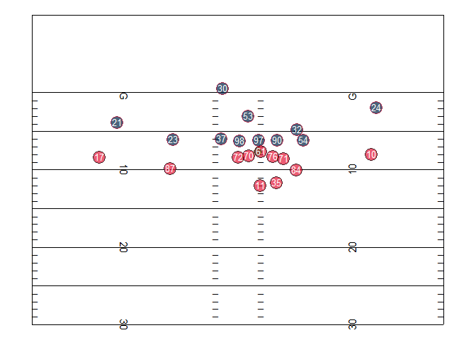

<!-- README.md is generated from README.Rmd. Please edit that file -->


Welcome to the data homepage for the NFL's 2019 Big Data Bowl. Here, you'll find links to 6 weeks of player tracking data from [Next Gen Stats](https://nextgenstats.nfl.com/), a style guide with references to each data set and each variable, a list of FAQs related to player tracking data and this contest, and a tutorial on how to visualize and animate the player tracking data using the [R Statistical Software](https://cran.r-project.org/).

What is contained in this repository
------------------------------------

There are four primary parts to this Github repo.

1.  Player tracking data from a subset of games from the 2017 season. See <https://github.com/nfl-football-ops/Big-Data-Bowl/tree/master/Data>. Tracking data from each game is stored as a unique .csv file: `tracking_gameId_[gameId].csv`, where `[gameId]` is a unique, 10-digit identifier for each game.

2.  Player, play, and game-level data that correspond to the tracking data. See <https://github.com/nfl-football-ops/Big-Data-Bowl/tree/master/Data> for each of these .csv files.

3.  A Data schema, which contains information on each of the variables in the data set, as well as the *key* variables needed to link the data sets together. See <https://github.com/nfl-football-ops/Big-Data-Bowl/blob/master/schema.md>.

4.  A list of Data FAQs. See <https://github.com/nfl-football-ops/Big-Data-Bowl/blob/master/faqs.md>.

Official rules
--------------

A complete set of official rules for the Big Data Bowl can be found [here](http://ops.nfl.com/big-data-bowl).

**Ownership of Next Gen Stats:** Data provided in this Contest (NGS Data) is solely owned by the Sponsor. Any and all rights to NGS Data granted to each Entrant are subject to the Sponsor’s ownership rights to the NGS Data. Each Entrant expressly acknowledges and agrees that it will not use, edit, modify, create derivatives, combinations or compilations of, combine, associate, re-identify, reverse engineer, reproduce, display, distribute, disclose, license, sell or otherwise process NGS Data for any purpose whatsoever other than to compete in this contest, unless expressly permitted otherwise by the Sponsor in writing. Each Entrant acknowledges that it is not authorized to archive NGS Data and may not grant to any other party any rights to access, use or process NGS Data. Under no circumstances is participation in this Contest intended to be construed as a license (expressly, by implication, estoppel, or otherwise) or the grant of any right of ownership in any of the NGS Data.

**Disclaimer of Warranties:** ENTRANT ACKNOWLEDGES THAT NGS DATA IS PROVIDED ON AN “AS IS” BASIS AND THAT THE SPONSOR MAKES NO REPRESENTATION OR WARRANTY WHATSOEVER, EXPRESS OR IMPLIED, WITH RESPECT TO NGS DATA.

**Confidentiality:** The NGS Data provided in this Contest is not generally available to the public. Each Entrant agrees that it shall keep NGS Data strictly confidential and not transmit, duplicate, publish, redistribute, provide or communicate the data (or any part thereof) to any other person or entity without the prior written consent of the Sponsor. Each Entrant shall destroy NGS Data in its possession following conclusion of this Contest.

What player tracking data looks like
------------------------------------

A brief tutorial using the `gganimate` [package](https://github.com/thomasp85/gganimate) in R to animate the tracking data follows.

### Reading in the data

First, the following code reads in a few of the different data sets and selects a play to animate (Tyreek Hill's TD reception during Week 1, video [here](https://www.youtube.com/watch?v=QJaC5jHOwDY))

``` r
library(tidyverse)
file.tracking <- "https://raw.githubusercontent.com/nfl-football-ops/Big-Data-Bowl/master/Data/tracking_gameId_2017090700.csv"
tracking.example <- read_csv(file.tracking)

file.game <- "https://raw.githubusercontent.com/nfl-football-ops/Big-Data-Bowl/master/Data/games.csv"
games.sum <- read_csv(file.game) 

file.plays <- "https://raw.githubusercontent.com/nfl-football-ops/Big-Data-Bowl/master/Data/plays.csv"
plays.sum <- read_csv(file.plays) 

tracking.example.merged <- tracking.example %>% inner_join(games.sum) %>% inner_join(plays.sum) 

example.play <- tracking.example.merged %>% filter(playId == 2756)

example.play %>% select(playDescription) %>% slice(1)
#> # A tibble: 1 x 1
#>   playDescription                                                          
#>   <chr>                                                                    
#> 1 (9:28) (Shotgun) A.Smith pass deep right to T.Hill for 75 yards, TOUCHDO~
```

### Animating the data

The following code animates each player that was on the field for Hill's touchdown. As one note, the code is flexible, such that plays at different parts of the field could feature different boundaries. As a second, the x-axis and y-axis coordinates are flipped.

``` r
library(gganimate)
library(cowplot)

## General field boundaries
xmin <- 0
xmax <- 160/3
hash.right <- 38.35
hash.left <- 12
hash.width <- 3.3


## Specific boundaries for a given play
ymin <- max(round(min(example.play$x, na.rm = TRUE) - 10, -1), 0)
ymax <- min(round(max(example.play$x, na.rm = TRUE) + 10, -1), 120)
df.hash <- expand.grid(x = c(0, 23.36667, 29.96667, xmax), y = (10:110))
df.hash <- df.hash %>% filter(!(floor(y %% 5) == 0))
df.hash <- df.hash %>% filter(y < ymax, y > ymin)

animate.play <- ggplot() +
  geom_point(data = example.play, aes(x = (xmax-y), y = x, 
                                 colour = team, group = nflId, pch = team, size = team)) + 
  geom_text(data = example.play, aes(x = (xmax-y), y = x, label = jerseyNumber), colour = "white", 
            vjust = 0.36, size = 3.5) + 
  scale_size_manual(values = c(6, 4, 6), guide = FALSE) + 
  scale_shape_manual(values = c(19, 16, 19), guide = FALSE) +
  scale_colour_manual(values = c("#e31837", "#654321", "#002244"), guide = FALSE) + 
  annotate("text", x = df.hash$x[df.hash$x < 55/2], 
           y = df.hash$y[df.hash$x < 55/2], label = "_", hjust = 0, vjust = -0.2) + 
  annotate("text", x = df.hash$x[df.hash$x > 55/2], 
           y = df.hash$y[df.hash$x > 55/2], label = "_", hjust = 1, vjust = -0.2) + 
  annotate("segment", x = xmin, 
           y = seq(max(10, ymin), min(ymax, 110), by = 5), 
           xend =  xmax, 
           yend = seq(max(10, ymin), min(ymax, 110), by = 5)) + 
  annotate("text", x = rep(hash.left, 11), y = seq(10, 110, by = 10), 
                    label = c("G   ", seq(10, 50, by = 10), rev(seq(10, 40, by = 10)), "   G"), 
                    angle = 270, size = 4) + 
  annotate("text", x = rep((xmax - hash.left), 11), y = seq(10, 110, by = 10), 
           label = c("   G", seq(10, 50, by = 10), rev(seq(10, 40, by = 10)), "G   "), 
           angle = 90, size = 4) + 
  annotate("segment", x = c(xmin, xmin, xmax, xmax), 
           y = c(ymin, ymax, ymax, ymin), 
           xend = c(xmin, xmax, xmax, xmin), 
           yend = c(ymax, ymax, ymin, ymin), colour = "black") + 
  ylim(ymin, ymax) + 
  coord_fixed() +  
  theme_nothing() + 
  transition_time(frame.id)  +
  ease_aes('linear') + 
  NULL

## Ensure timing of play matches 10 frames-per-second
play.length.ex <- length(unique(example.play$frame.id))
animate(animate.play, fps = 10, nframe = play.length.ex)
```


