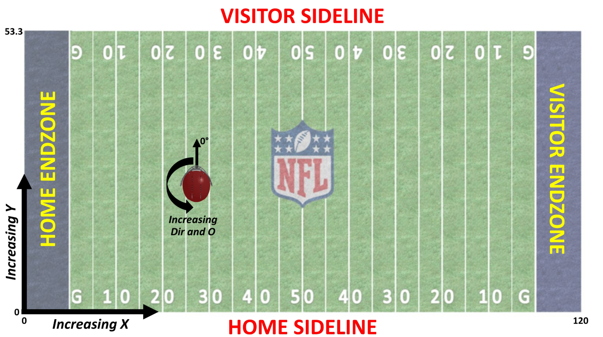

<!-- README.md is generated from README.Rmd. Please edit that file -->

```{r, echo = FALSE}
knitr::opts_chunk$set(
  collapse = TRUE,
  comment = "#>",
  fig.path = "man/figures/README-"
)
```

## Summary of data

Here, you'll find a summary of each data set in the 2019 Data Bowl, a list of *key* variables to join on, and a description of each variable. 


## File descriptions

Game data: The `games.csv` file contains game-level information for each game from the first 6 weeks of the 2017 season. The *key* variable is **`gameId`**.

Play data: The `plays.csv` file contains play-level information from each game from the first 6 weeks of the 2017 season. The *key* variables are **`gameId`** and **`playId`**. 

Player data: The `players.csv` file contains player-level information from players that participated in at least one play during the first six weeks of the 2017 regular season. The *key* variable is **`nflId`**.

Tracking data: Files `tracking_gameId_[gameId].csv` contain player tracking data from game `[gameId]`. Nearly all plays from `[gameId]` are included; certain plays with incomplete or missing data are dropped. The *key* variables are **`gameId`**, **`playId`**, and **`nflId`**. 

## Game data

- `season`: Season of game (numeric)
- `week`: Week of game, 1 through 6 (numeric)
- `gameDate`: Game Date (time, mm/dd/yyyy)
- **`gameId`**: Game identifier, unique (numeric)
- `gameTimeEastern`: Start time of game (time, HH:MM:SS, EST)     
- `HomeScore`: Final score for the home team (numeric)
- `VisitorScore`: Final score for the away team (numeric)
- `homeTeamAbbr`: Home team three-letter code (text)
- `visitorTeamAbbr`: Visiting team three-letter code (text)
- `homeDisplayName`: Home team name (text)
- `visitorDisplayName`: Visiting team name (text)
- `Stadium`: Stadium (text)
- `Location`: City (text)
- `StadiumType`: Type of stadium (text)
- `Turf`: Surface of stadium (text)              
- `GameLength`: Time the game took to complete (time, HH:MM:SS)
- `GameWeather`: Game weather (text)
- `Temperature`: Temperature in Farenheit, drawn roughly at the start of the game (numeric)
- `Humidity`: Humidity (numeric)
- `WindSpeed`: Wind speed, in miles-per-hour (numeric)
- `WindDirection`: Direction of wind (text)


## Play data


- **`gameId`**: Game identifier, unique (numeric)
- **`playId`**: Play identifier, not unique across games (numeric)
- `quarter`: Game quarter (numeric)
- `GameClock`: Time on game clock at start of play (time, counting down from 15:00, MM:SS)
- `down`: Down (numeric)
- `yardsToGo`: Distance needed for a first down (numeric)
- `yardlineSide`: 3-letter team code corresponding to line-of-scrimmage (text)
- `yardlineNumber`: Yard line at line-of-scrimmage (numeric)
- `personnel.offense`: Personnel used by offensive team (text)
- `defendersInTheBox`: Number of defenders in close proximity to line-of-scrimmage (numeric)
- `numberOfPassRushers`: Number of pass rushers (numeric)
- `personnel.defense`: Personnel used by defensive team (text)
- `HomeScoreBeforePlay`: Home score prior to the play (numeric)
- `VisitorScoreBeforePlay`: Visiting team points at the end of the play (numeric)
- `HomeScoreAfterPlay`: Home team points at the end of the play (numeric)
- `VisitorScoreAfterPlay`: Humidity (numeric) 
- `isPenalty`: Wind speed (numeric)
- `isSTPlay`: TRUE/FALSE for whether or not the play is labelled a special teams play (binary) 
- `SpecialTeamsPlayType`: Type of play if `isSTPlay == TRUE` (text) 
- `KickReturnYardage`: Return yardage among special teams plays (numeric)
- `PassLength`: Pass length, in yards (numeric)
- `PassResult`: Result of pass play (text, `C`: caught, `I`: incomplete, `IN`: intercepted, `R`: run, `S`: sack)
- `YardsAfterCatch`: Yardage receiver gained after a pass completion (numeric)
- `PlayResult`: Result of play, in yards (numeric)


## Player data

- **`nflId`**: Player identification number, unique across players (numeric)
- `FirstName`: First name of player (text)
- `LastName`: Last name of player (text)
- `PositionAbbr`: Position of player (text)
- `EntryYear`: Year in which player entered NFL (numeric)
- `DraftRound`: Round in which player was drafted --`NULL` for players not drafted (numeric)
- `DraftNumber`: Overall pick number among drafted players (numeric)
- `Height`: Player height in feet/inches (text)
- `Weight`: Player weight in pounds (numeric)
- `College`: Player college (text)

## Tracking data

Files `tracking_gameId_[gameId].csv` contains player tracking data from game `[gameId]`. Nearly all plays from `[gameId]` are included; certain plays with insufficient data are dropped.

- `time`: Time stamp of play (time, yyyy-mm-dd, hh:mm:ss)
- `x`: Player position along the long axis of the field, 0 - 120 yards. See Figure 1 below. (numeric)
- `y`: Player position along the short axis of the field, 0 - 53.3 yards. See Figure 1 below. (numeric)
- `s`: Speed in yards/second (numeric)
- `dis`: Distance traveled from prior time point, in yards (numeric)
- `dir`: Angle of player motion (deg), 0 - 360 degrees (numeric)
- `event`: Tagged play details, including moment of ball snap, pass release, pass catch, tackle, etc (text)
- **`nflId`**: Player identification number, unique across players (numeric)
- `displayName`: Player name (text)
- `jerseyNumber`: Jersey number of player (numeric)
- `team`: Team (away or home) of corresponding player (text)
- `frame.id`: Frame identifier for each play, starting at 1 (numeric)
- **`gameId`**: Game identifier, unique (numeric)
- **`playId`**: Play identifier, not unique across games (numeric)




